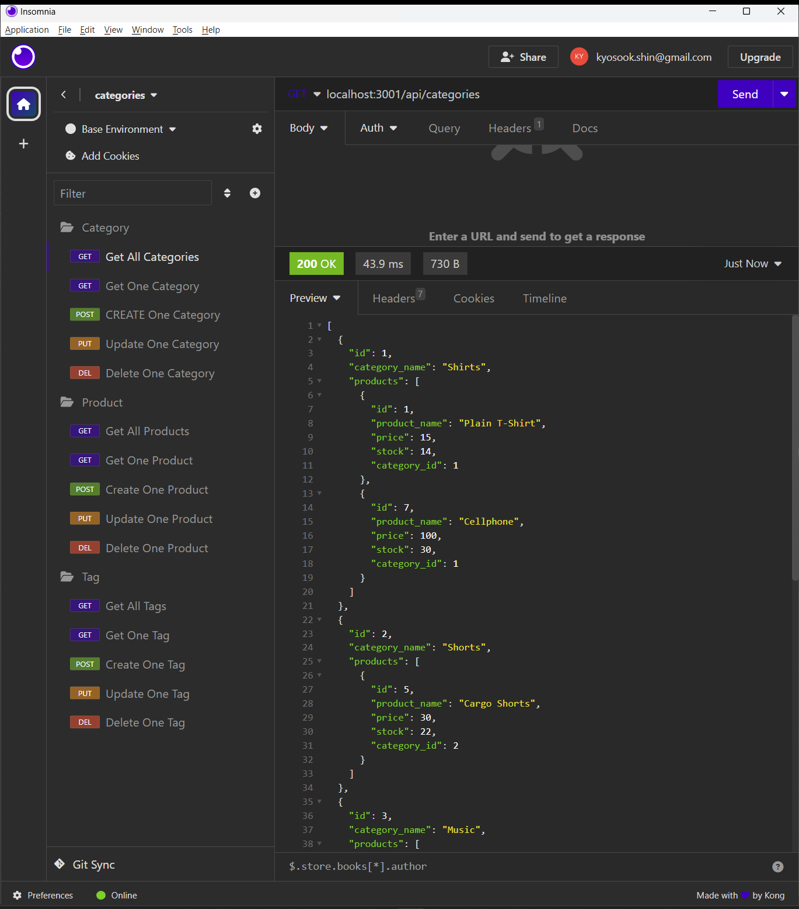
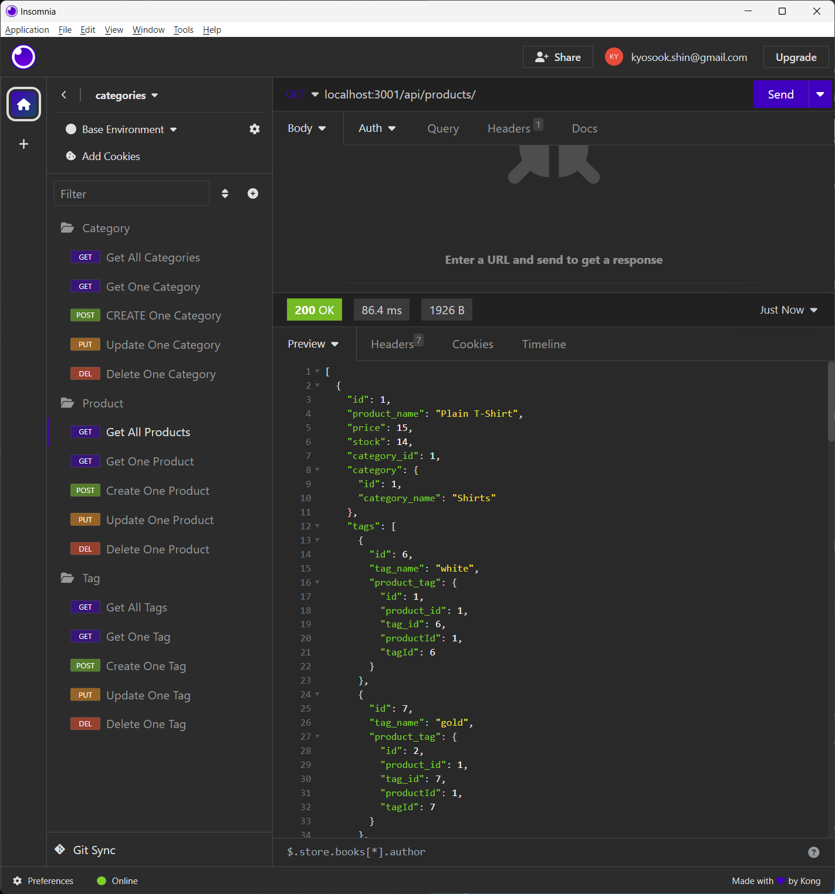
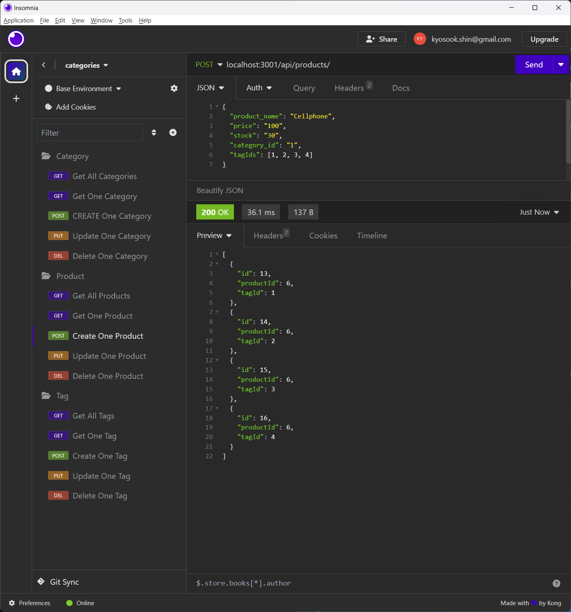

# E-commerce Back End
  * Author: Kyosook Shin
  * Author's Email: kyosook.shin@gmail.com  
  * GitHub: https://github.com/alla0810/e-commerce
  * Walkthrough Video: https://drive.google.com/file/d/1wYZBMuzOfqjXdAPhoa_-UlDJODOfpkUC/view
  
  * screenshot  

  

  

## Source Code References
  This project has used some reference codes from the following sites

   * https://git.bootcampcontent.com/University-of-Texas-at-Austin/UTA-VIRT-FSF-PT-07-2023-U-LOLC.git   

   
## User Story

AS a manager at an internet retail company
I WANT a back end for my e-commerce website that uses the latest technologies
SO THAT my company can compete with other e-commerce companies

## Acceptance Criteria

GIVEN a functional Express.js API

* WHEN I add my database name, MySQL username, and MySQL password to an environment variable file, THEN I am able to connect to a database using Sequelize

* WHEN I enter schema and seed command, THEN a development database is created and is seeded with test data

* WHEN I enter the command to invoke the application, THEN my server is started and the Sequlize models are synced to the MySQL database

* WHEN I open API GET routes in Insomnia Core for categries, products, or tags, THEN the data for each of these routes is displayed in a formatted JSON

* WHEN I test API POST, PUT, and DELETE routes in Insomnia Core, THEN I am able to successfully create, update, and delete data in my database

## Mock-Up
The following animations show examples of the application's API routes being tested in Insomnia Core.
The first animation shows GET routes to return all categories, all products, and all tags being tested in Insomnia Core:

The second animation shows GET routes to return a single category, a single product, and a single tag being tested in Insomnia Core:

The final animation shows the POST, PUT, and DELETE routes for categories being tested in Insomnia Core:

Your walkthrough video should also show the POST, PUT, and DELETE routes for products and tags being tested in Insomnia Core.

## Getting Started
You'll need to use the MySQL2 and Sequelize packages to connect to your Express.js API to a MySQL database and the dotenv package to use environment variables to store sensitive data, like your MySQL username, password, and database name.
Use the `schema.sql` file in the `db` folder to create your database using MySQL shell commands.  Use environment variables to store sensitive data, like your MySQL username, password, and database name.

## Database Models

Your database should contain the following four models, including the requirements listed for each model:

* `Category`  
  * `id`
  * Integer  
  * Doesn't allow null values  
  * Set as primary key  
  * Uses auto increment  
  * `category_name`  
  * String  
  * Doesn't allow null values

* `Product`  
  * `id`  
  * Integer
  * Doesn't allow null values  
  * Set as primary key  
  * Uses auto increment  
  * `product_name`  
  * String  
  * Doesn't allow null values  
  * `price`  
  * Decimal
  * Doesn't allow null values  
  * Validates that the value is a decimal
  * `stock`  
  * Integer
  * Doesn't allow null values  
  * Set a default value of 10  
  * Validates that the value is numeric
  * `category_id`  
  * Integer
  * References the `category` model's `id`
  

* `Tag`  
  * `id`  
  * Integer
  * Doesn't allow null values  
  * Set as primary key  
  * Uses auto increment  
  * `tag_name`  
  * String  

* `ProductTag`  
  * `id`  
  * Integer
  * Doesn't allow null values  
  * Set as primary key  
  * Uses auto increment  
  * `product_id`  
  * Integer  
  * References the `product` model's `id`
  * `tag_id`  
  * Integer  
  * References the `tag` model's `id`

## Associations
You'll need to execute association methods on your Sequelize models to create the following relationships between them:
* `Product` belongs to `Category`, as a category can have multiple products but a product can only belong to one category.
* `Category` has many `Product` models.
* `Product` belongs to many `Tag` models.  Using the `ProductTag` through model, allow products to have multiple tags and tags to have many products.
* `Tag` belongs to many `Product` models.

Make sure you set up foreign key relationships that match the column we created in the respective models.

## Fill Out the API Routes to Perform RESTfull CRUD Operations
Fill out the unfinished routes in `product-routes.js`, `tag-routes.js`, and `category-routes.js` to perform create, read, update, and delete operations using your Sequelize models.

Be sure to look at your module project's code for syntax help and use your model's column definitions to figure out what `req.body` will be for POST and PUT routes!

## Seed the Database
After creating the models and routes, run `npm run seed` to seed data to your database so that you can test your routes.

## Sync Sequelize to the Database on Server Start
Create the code needed in `server.js` to sync the Sequlize models to the MySQL database on server start.

## Delierables: 10%
* Your GitHub repository containing your application code.

## Walkthrough Video: 37%
* A walkthrough video that demonstrates the functionality of the e-commerce back end must be submitted, and a link to the video should be included in your README file
* The walkthrough video must show all of the technical acceptance criteria being met.
* The walkthrough video must demonstrate how to create the schema from the MySQL shell.
* The walkthrough video must demonstrate how to seed database from the command line.
* The walkthrough video must demonstrate how to start the application's server.
* The walkthrough video must demonstrate GET routes for al categories, all products, and all tags being tested in Insomnia Core.
* The walkthrough video must demonstrate GET routes for a single category, a single product, and a single tag being tested in Insomnia Core.
* The walkthrough video must demonstrate POST, PUT, and DELETE routes for categories, products, and tags being tested in Insomnia Core.

## Technical Acceptance Criteria: 40%
* Satisfies all of the preceding acceptance criteria plus the following:  
  * Uses the MySQL2 and Sequlize packages to connect to a MySQL database.
  * Uses the dotenv package to use environment variables to store sensitive data, like a user's MySQL username, password, and database name.
* Sync Sequelize models to a MySQL database on the server start.
* Includes column definitions for all four models outlined in the Challenge instructions.
* Includes model associations outlined in the Challenge instructions.

## Repository Quality: 13%
* Repository has a unique name.
* Repository follows best practices for file structure and naming conventions.
* Repository follows best practices for class/id naming conventions, indentation, high-quality comments, etc.
* Repository contains multiple descriptive commit messages.
* Repository contains a high-quality README file with description, a link to a walkthrough video.

