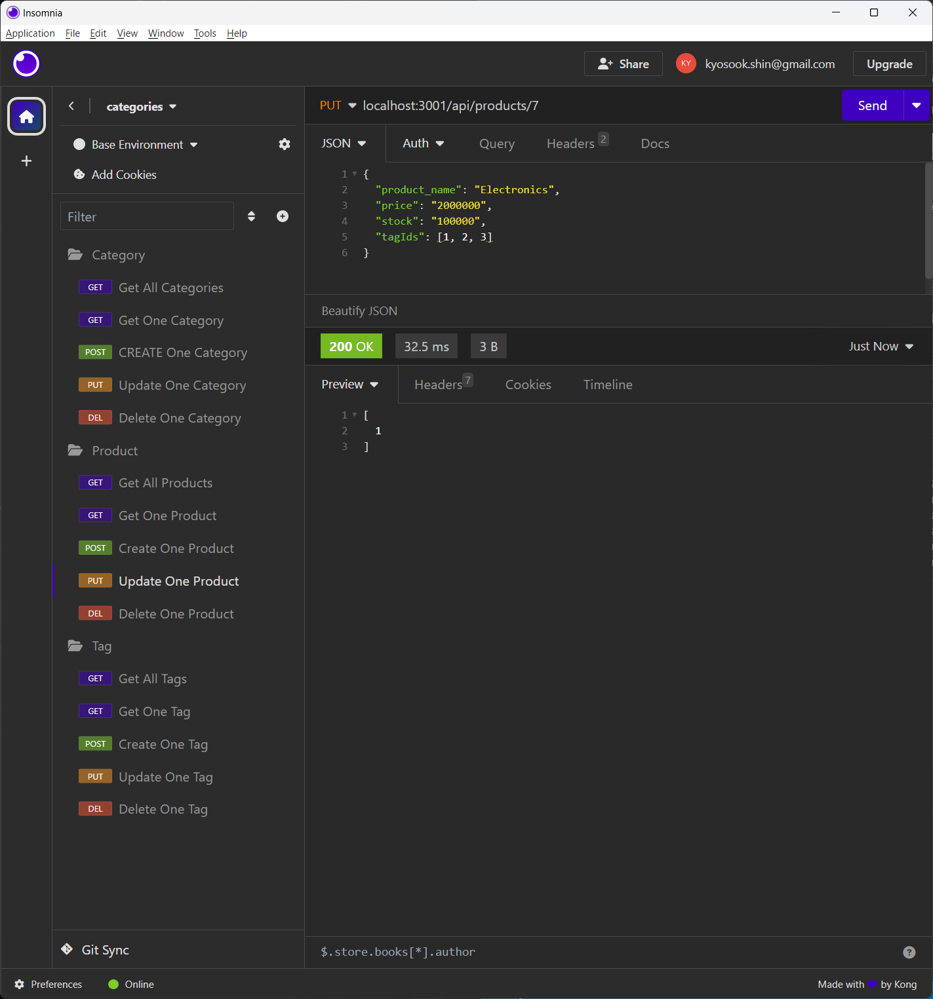
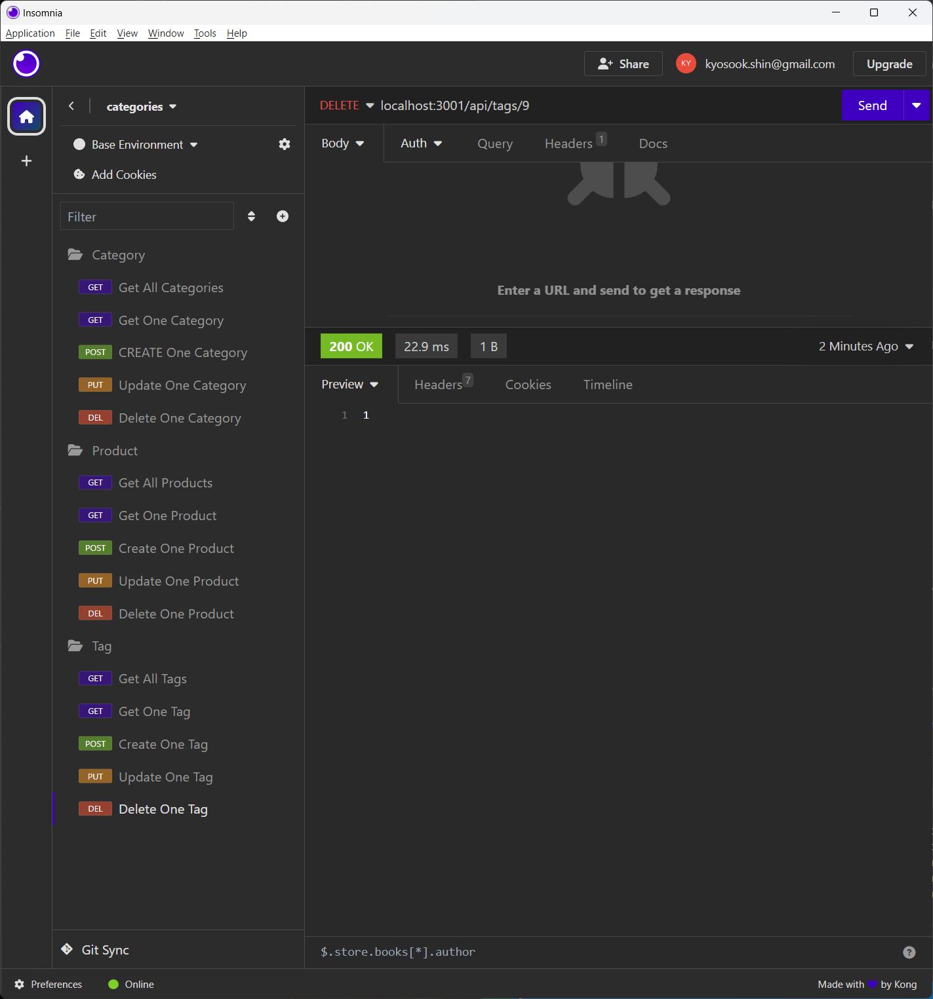

# E-commerce Back End  

## Description

This program provides a manager at an internet retail company with a back end for e-commerce website that uses the latest thechnologies so that the company can compete with other e-commerce companies.

## Features

GIVEN a functional Express.js API

* WHEN you add my database name, MySQL username, and MySQL password to an environment variable file, THEN you are able to connect to a database using Sequelize

* WHEN you enter schema and seed command, THEN a development database is created and is seeded with test data

* WHEN you enter the command to invoke the application, THEN your server is started and the Sequlize models are synced to the MySQL database

* WHEN you open API GET routes in Insomnia Core for categries, products, or tags, THEN the data for each of these routes is displayed in a formatted JSON

* WHEN you test API POST, PUT, and DELETE routes in Insomnia Core, THEN you am able to successfully create, update, and delete data in your database

## Rest API Routes
* This application provides Rest APIs for an e-commerce backend application

1. /api/categories
  * `GET` all categories
  * `GET` a single category by its `id` and populated products
  * `POST` a new category
  * `PUT` to update a category by its `id`
  * `DELETE` to remove category by its `id`

2. /api/products
  * `GET` to get all products and all of associated tags
  * `GET` to get a single product by its `id` and all of its associated tags
  * `POST` to create a new product and to associate the new product with `tagIds`
  * `PUT` to update a product by its `id`
  * `DELETE` to remove a product by its `_id`  

3. /api/thoughts/:thoughtId/reactions
  * `GET` to get all tags and all of associated products
  * `GET` to get a single tag by its `id` and all of its associated products
  * `POST` to create a new tag and to associate the new tag with `productIds`
  * `PUT` to update a tag by its `id`
  * `DELETE` to remove a tag by its `_id`  

## Database Models

This application's database contains the following four models:

* `Category`  
  * `id`
  * Integer  
  * Doesn't allow null values  
  * Set as primary key  
  * Uses auto increment  
  * `category_name`  
  * String  
  * Doesn't allow null values

* `Product`  
  * `id`  
  * Integer
  * Doesn't allow null values  
  * Set as primary key  
  * Uses auto increment  
  * `product_name`  
  * String  
  * Doesn't allow null values  
  * `price`  
  * Decimal
  * Doesn't allow null values  
  * Validates that the value is a decimal
  * `stock`  
  * Integer
  * Doesn't allow null values  
  * Set a default value of 10  
  * Validates that the value is numeric
  * `category_id`  
  * Integer
  * References the `category` model's `id`
  

* `Tag`  
  * `id`  
  * Integer
  * Doesn't allow null values  
  * Set as primary key  
  * Uses auto increment  
  * `tag_name`  
  * String  

* `ProductTag`  
  * `id`  
  * Integer
  * Doesn't allow null values  
  * Set as primary key  
  * Uses auto increment  
  * `product_id`  
  * Integer  
  * References the `product` model's `id`
  * `tag_id`  
  * Integer  
  * References the `tag` model's `id`

## Associations
Four database models have the following relationships between them:
* `Product` belongs to `Category`, as a category can have multiple products but a product can only belong to one category.
* `Category` has many `Product` models.
* `Product` belongs to many `Tag` models.  Using the `ProductTag` through model, allow products to have multiple tags and tags to have many products.
* `Tag` belongs to many `Product` models.

## Walkthrough Video
https://drive.google.com/file/d/1N0QrQbP3RqnyN9QxMiiXK89BWkpQlmIG/view

## Installation on your local machine
After downloading from GitHub, you can run this program on your local machine by following the procedure below:
1. From a terminal, log into your mySQL account by using `mysql -u ${your login name} -p`.
2. Inside logged mySQL terminal, type `source ${downloaded-application-path}/db/schema.sql`.
3. Open another terminal to run javascript e-commerce back-end server application.
4. Run `npm run seed` to seed data. Seed data create 5 categories, 5 product and 8 tags. 
5. Run `nodemon server.js` to run backend server on your local machine.
6. From Insomnia, send Restful API queries.

## Source Code References
  This project has used some reference codes from the following sites

   * https://git.bootcampcontent.com/University-of-Texas-at-Austin/UTA-VIRT-FSF-PT-07-2023-U-LOLC.git   

## Contact
  * Author: Kyosook Shin
  * Author's Email: kyosook.shin@gmail.com  
  * GitHub: https://github.com/alla0810/e-commerce

## Screenshot  

  

  
  
  
